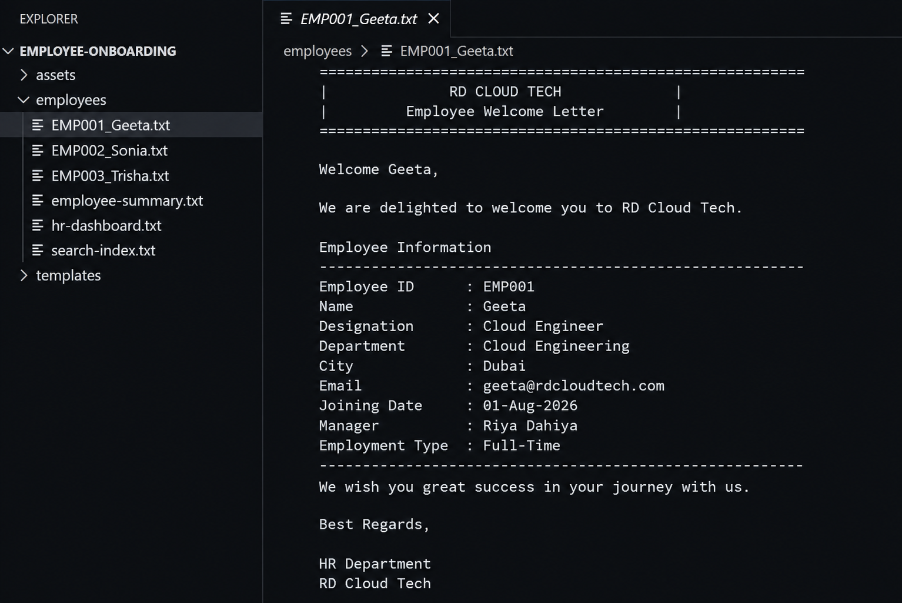
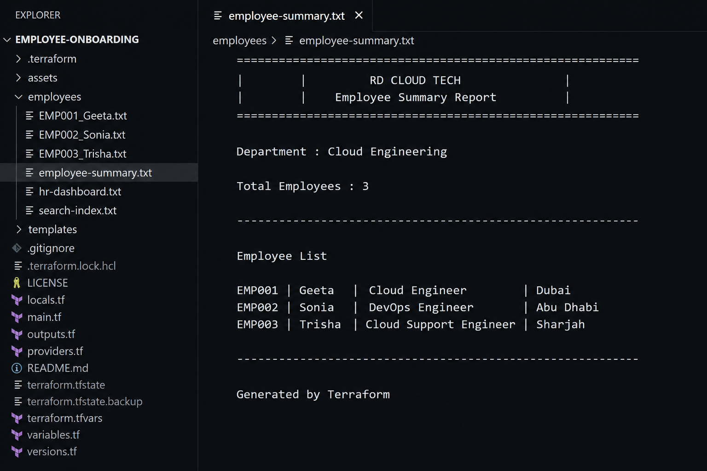
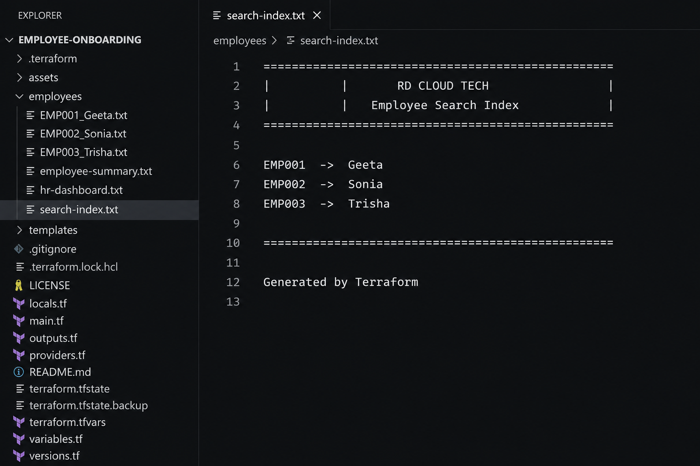
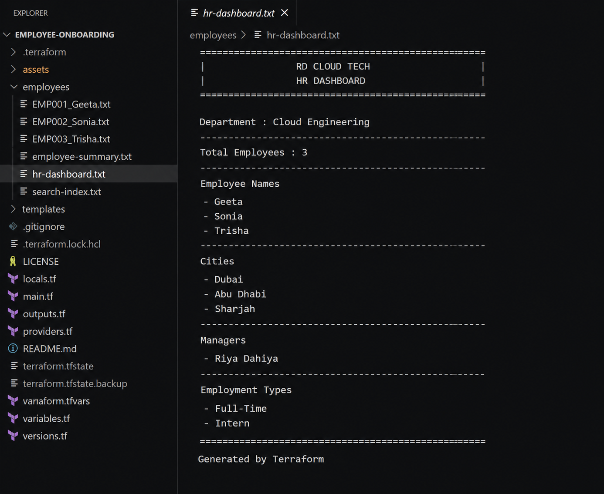
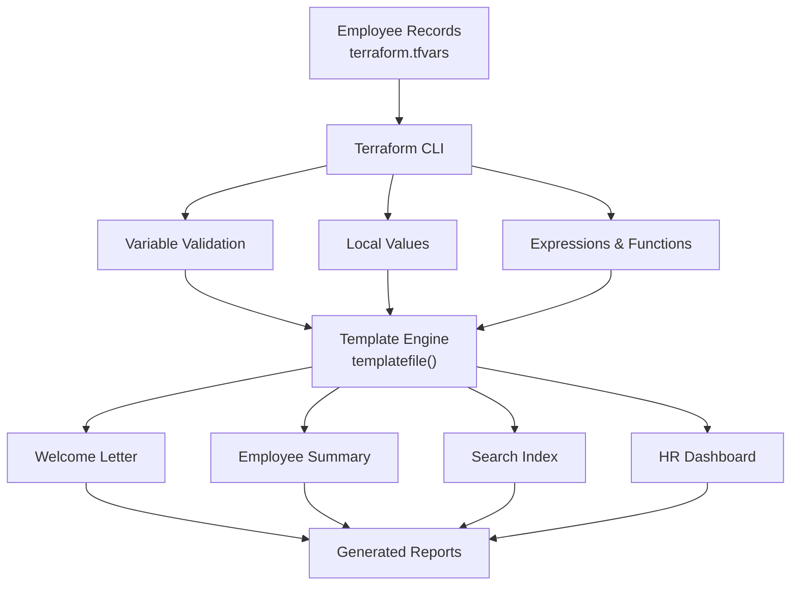

<div align="center">

# 🚀 Terraform Employee Onboarding Automation

### Production-Inspired Infrastructure as Code (IaC) Project using HashiCorp Terraform

Automates employee onboarding by generating personalized welcome letters, HR reports, search indexes, and dashboards using Terraform templates.

</div>
<p align="center">


</p>


## 📌 Project Status

| Property | Value |
|----------|-------|
| Version | v1.0.0 |
| Status | Completed |
| Project Type | Portfolio Project |
| Terraform Version | v1.x |
| Platform | Windows |
| Cloud Resources | None (Local Provider) |
| Difficulty | Beginner → Intermediate |

## 📑 Table of Contents

- [Overview](#-overview)
- [Project Preview](#-project-preview)
- [Business Problem](#-business-problem)
- [Solution](#-solution)
- [Features](#-features)
- [Project Highlights](#-project-highlights)
- [Project Architecture](#-project-architecture)
- [Folder Structure](#-folder-structure)
- [Terraform Concepts & Skills Demonstrated](#-terraform-concepts--skills-demonstrated)
- [Workflow](#-workflow)
- [How to Run](#-how-to-run)
- [Security Best Practices](#-security-best-practices)
- [Future Improvements](#-future-improvements)
- [Author](#-author)

##  Overview

This project simulates a real-world HR onboarding workflow using HashiCorp Terraform.

Instead of manually preparing employee documents, Terraform dynamically generates welcome letters, HR reports, employee search indexes, and dashboards from structured employee data.

The project demonstrates how Infrastructure as Code (IaC) principles can automate repetitive business processes while applying Terraform best practices such as validation, template rendering, reusable configurations, dynamic expressions, and sensitive variables.

## 📸 Project Preview

### Repository Overview

<p align="center">

</p>

---

### Generated Outputs

<table>

<tr>

<td align="center" width="50%">

<b>📄 Welcome Letter</b>

<br><br>



</td>

<td align="center" width="50%">

<b>📊 Employee Summary</b>

<br><br>



</td>

</tr>

<tr>

<td align="center">

<b>🔍 Search Index</b>

<br><br>



</td>

<td align="center">

<b>📈 HR Dashboard</b>

<br><br>



</td>

</tr>

</table>

##  Business Problem

In many organizations, HR teams manually prepare onboarding documents for every new employee.

This process is repetitive, time-consuming, and prone to human errors.

As the number of employees grows, maintaining consistency across welcome letters, summaries, and reports becomes difficult.

##  Solution

This project automates the onboarding workflow using Terraform.

Based on employee information provided in `terraform.tfvars`, Terraform automatically generates:

- Personalized Welcome Letters
- Employee Summary Report
- Search Index
- HR Dashboard

The project also validates employee data before generating outputs, ensuring consistency and reducing manual effort.

##  Features

- Automated employee onboarding documents
- Dynamic Terraform templates
- Personalized welcome letters
- Employee summary report
- HR dashboard generation
- Search index generation
- Input validation
- Sensitive variable demonstration
- Reusable local values
- Clean project structure

##  Project Highlights

- Generates onboarding documents automatically
- Eliminates repetitive HR tasks
- Demonstrates Infrastructure as Code principles
- Simulates a real-world onboarding workflow
- Designed without cloud resources for local learning

##  Project Architecture



##  Folder Structure

employee-onboarding/
│
├── assets/
│   ├── banners/
│   ├── gifs/
│   ├── icons/
│   └── screenshots/
│
├── employees/
│   ├── EMP001_Geeta.txt
│   ├── EMP002_Sonia.txt
│   ├── EMP003_Trisha.txt
│   ├── employee-summary.txt
│   ├── search-index.txt
│   └── hr-dashboard.txt
│
├── templates/
│   ├── welcome.tftpl
│   ├── summary.tftpl
│   ├── search-index.tftpl
│   └── dashboard.tftpl
│
├── .gitignore
├── LICENSE
├── locals.tf
├── main.tf
├── outputs.tf
├── providers.tf
├── README.md
├── terraform.tfvars
├── variables.tf
└── versions.tf

##  Terraform Concepts & Skills Demonstrated

### Core Terraform

- HashiCorp Terraform
- Infrastructure as Code (IaC)
- Terraform CLI
- Terraform State Management
- Terraform Providers

### Configuration

- Variables
- terraform.tfvars
- Local Values
- Outputs
- Sensitive Variables

### Data Structures

- map(object)
- for_each
- Dynamic Expressions
- Functions
- Conditional Logic

### Templates

- templatefile()
- Dynamic File Generation
- Local Provider

### Best Practices

- Variable Validation
- Reusable Configuration
- Modular Design
- Code Formatting (`terraform fmt`)
- Configuration Validation (`terraform validate`)


## 🔄 Workflow

```text
Employee Data
      │
      ▼
terraform.tfvars
      │
      ▼
Terraform Plan
      │
      ▼
Terraform Apply
      │
      ▼
Generate Reports
      │
      ▼
Employees Folder
```

## ▶️ How to Run

### Clone Repository

```bash
git clone https://github.com/Riyadahiya01/terraform-employee-onboarding.git
```

### Navigate to Project

```bash
cd terraform-employee-onboarding
```

### Initialize Terraform

```bash
terraform init
```

### Review Execution Plan

```bash
terraform plan
```

### Apply Configuration

```bash
terraform apply
```

##  Security Best Practices

This project follows Terraform security best practices.

- No real passwords or cloud credentials are included.
- Sensitive values are demonstrated using placeholder data.
- Terraform Sensitive Variables prevent accidental exposure in CLI output.
- Placeholder values such as `DEMO_SECRET_VALUE` are used for educational purposes only.


##  Future Improvements

- AWS S3 integration for document storage
- Amazon SES email notifications
- AWS Lambda-based onboarding workflow
- DynamoDB employee records
- Remote Terraform state backend (Amazon S3 + DynamoDB)
- Multi-environment deployment (Dev / Test / Production)

## 👩‍💻 Author

**Riya Dahiya**

- GitHub:https://github.com/Riyadahiya01
- LinkedIn: www.linkedin.com/in/riya-dahiya-

---

<div align="center">

Made with ❤️ using **HashiCorp Terraform**


</div>